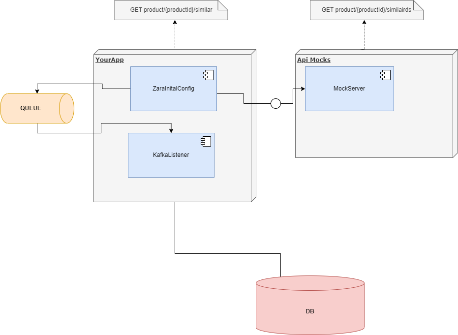

Step 1: Clone git repository ```https://git-rba.hackerrank.com/git/fa910f35-4717-485e-8bbe-bd32218bac1f```

# 1. Java Springboot project

## Backend development technical test

We want to offer a new feature to our customers by showing similar products to the one they are currently viewing. 
To do this, we agree with our front-end applications to create a new REST API operation that will provide them with 
the product details of similar products for a given one. **Here** ***./code/src/main/resources/similarProducts.yaml*** is 
the contract we agreed to.

There is already **a REST API operation available** ***./code/src/main/resources/similarProductEngineAPI.yaml*** 
that provides similar product IDs for a given one. It is implemented as a mock 
**here** ***../code/src/main/java/com/inditex/zarachallenge/config/ZaraInitialConfig.java*** 
and you must generate a REST client to consume it.

There is also a database where all the product information is stored using **this schema** ***./code/src/main/resources/schema.sql.*** 
You must implement a data access layer to get the needed information.

Finally, we also give you **a queue** ***./code/src/main/java/com/inditex/zarachallenge/infrastructure/KafkaListener.java*** 
where the stock availability changes are notified for each product. You must implement a listener to process those messages 
to update the product information in the database.

In this **file** ***./code/src/main/resources/application.properties*** you can extract the date of the current day. 
This is necessary to find the price of the product.

**Your mission is to create a Spring Boot application that:**
- Processes the stock availability events updating the information in the database.
- Exposes the agreed SimilarProducts API that will be consumed by the front-end.




## Software Instructions

The question(s) requires  **Java Development Kit 17**.

-   [Install JDK 17 on MacOS](https://docs.oracle.com/en/java/javase/17/install/installation-jdk-macos.html)
-   [Install JDK 17 on Windows](https://docs.oracle.com/en/java/javase/17/install/installation-jdk-microsoft-windows-platforms.html)
-   [Install JDK 17 on Linux](https://docs.oracle.com/en/java/javase/17/install/installation-jdk-linux-platforms.html)
-   [Install Maven](https://maven.apache.org/install.html)


## Git Instructions

Use the following commands to work with this project:

### Run
```
mvn clean spring-boot:run
```

### Test
```
mvn clean test;
```

### Install
```
mvn clean install
```
